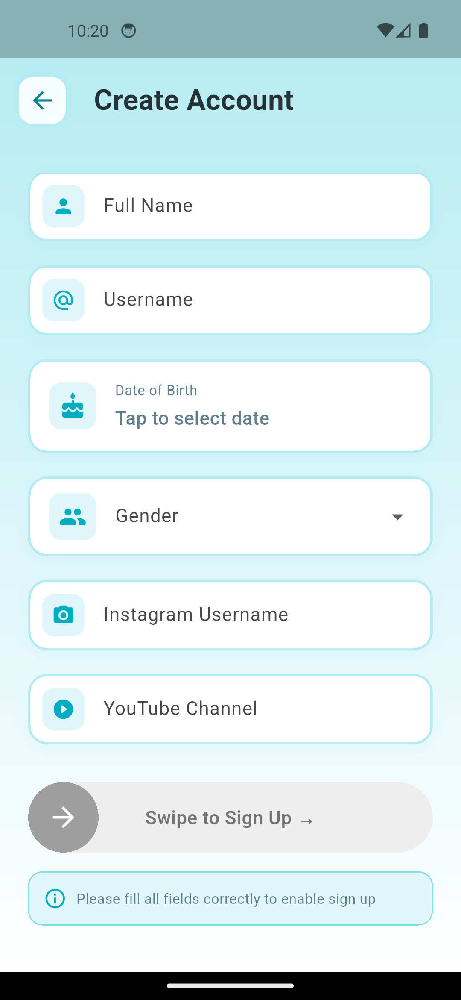
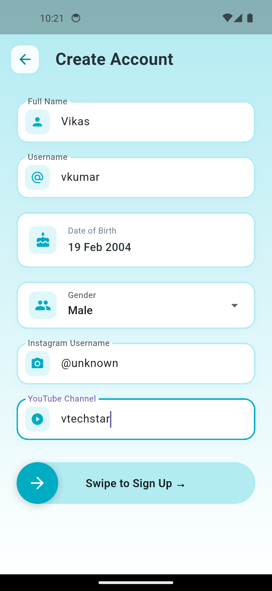
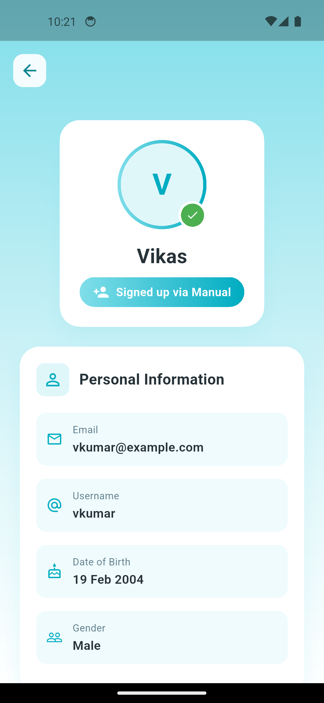
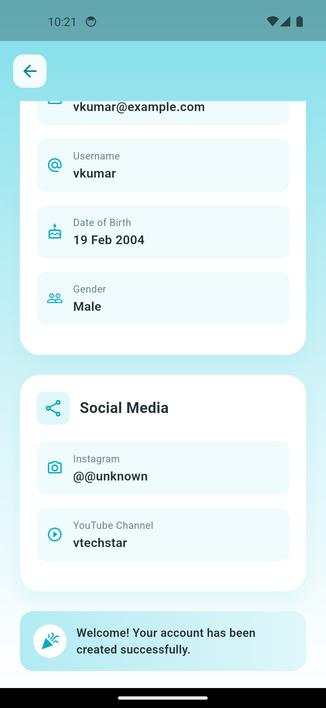
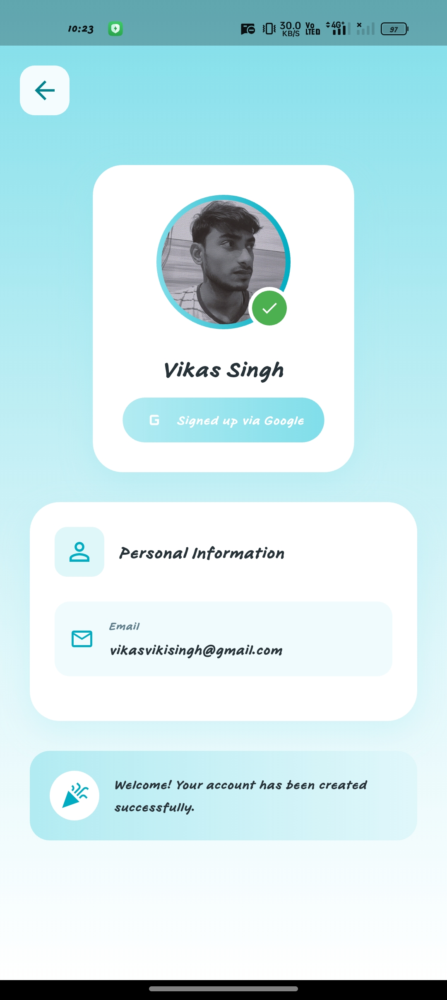

# 🚀 Flutter Authentication Flow App

A **clean, scalable Flutter authentication system** built using **MVVM architecture**, featuring **Google Sign-In, real-time form validation, and premium UI/UX**. Fully **cross-platform (Android & iOS)**.

---

## ✨ Features

* Google Sign-In (OAuth 2.0)
* Manual Signup with Real-time Validation
* Swipe-to-confirm interaction
* Smooth animations & responsive UI
* MVVM + Clean Architecture
* Android & iOS support

---

## 📸 Screenshots

<p align="center">
  
  
  
</p>

<p align="center">
  
  
  
</p>

---

## 🧠 Architecture

**MVVM (Model–View–ViewModel) + Clean Layered Structure**

```
lib/
 ├── models/
 ├── screens/
 ├── services/
 ├── widgets/
 ├── utils/
```

---

## 🛠 Tech Stack

Flutter • Dart • MVVM • Google Sign-In • Material UI

---

## 🚀 Run Locally

```bash
git clone https://github.com/silentboy-07/flutter-auth-flow.git
cd flutter-auth-flow
flutter pub get
flutter run
```

---

## 👨‍💻 Author

**Vikas Singh**
Flutter Developer

---

⭐ If you like this project, give it a star!
